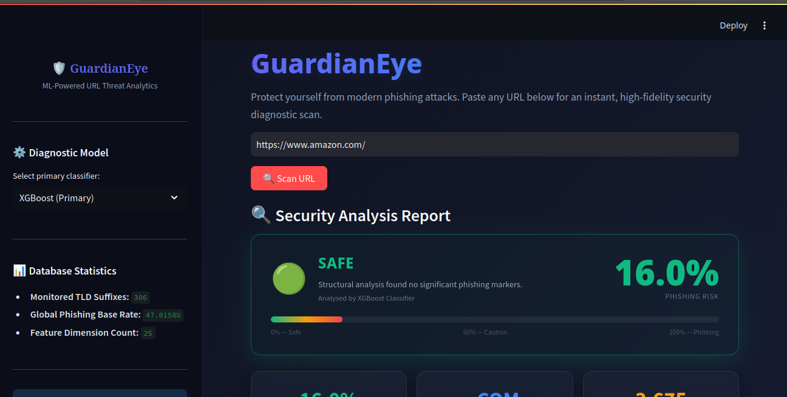

# Phishing URL Detector 🚨


## 📌 Overview

This project is a **machine learning-based phishing URL detection system** that classifies URLs as **Safe ✅** or **Phishing ⚠️**.

The model is trained using **URL-based features only**, making it:

* Fast ⚡
* Lightweight 💡
* Suitable for real-time prediction 🌐

---

## 🚀 Features

* Detects phishing URLs instantly
* Uses 50+ engineered URL features
* Streamlit-based interactive UI
* Pre-trained ML model (`.pkl`)

---

## 🧠 Model Details

* Algorithm: XGBoost / LightGBM
* Input: URL string
* Output: Safe / Phishing
* Feature Type: URL-based (no webpage scraping)

---

## 📁 Project Structure

```
phishing-url-detector/
│
├── phishing_app.py
├── requirements.txt
├── README.md
├── screenshots/
|    |──phishing_home.png
|    |──phishing_analysis.png
|    |──phishing_results.png
|
|──assets/
|    |──global_mean.pkl
|    |──tld_phishing_rate.pkl
|
├── model/
│   ├── xgboost_phishing_model.joblib
│   ├── random_forest_phishing_model.joblib
│   ├── lightgbm_phishing_model.joblib
|
├── features/
│   ├── feature_extractor.py
│ 
|── notebooks/
    |── phishing_url_detector.ipynb
```

---

## ⚙️ Installation

### 1. Clone the repository

```bash
git clone https://github.com/your-username/phishing-url-detector.git
cd phishing-url-detector
```

### 2. Create virtual environment

```bash
python3 -m venv venv
source venv/bin/activate
```

### 3. Install dependencies

```bash
./venv/bin/python -m pip install -r requirements.txt
```

---

## ▶️ Run the App

```bash
./venv/bin/python -m streamlit run phishing_app.py
```

---

## 🧪 Example

Input:

```
http://secure-login-paypal.com
```

Output:

```
⚠️ Phishing Website
```

---

## ⚠️ Disclaimer

This tool is for **educational purposes only** and should not be used as the sole method for security decisions.

---

## 📬 Contact

If you have suggestions or improvements, feel free to open an issue or contribute.
